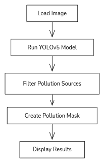
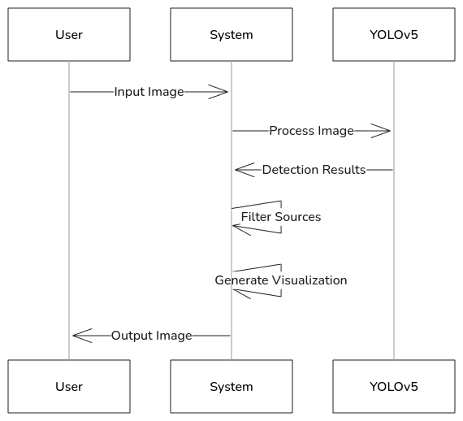

# **Analyze Images**

## **1. Overview**

This report details an AI-powered pollution source detection system utilizing the YOLOv5 object detection model.



## **2. Core Components**

### **2.1 Image Loading**

```python
def load_image(image_path):
    img_bgr = cv2.imread(image_path)
    img_rgb = cv2.cvtColor(img_bgr, cv2.COLOR_BGR2RGB)
    return img_rgb
```

-   Handles image loading with OpenCV
-   Converts images from BGR to RGB format

### **2.2 Pollution Source Detection**

-   Utilizes the YOLOv5s pretrained model
-   Detects the following pollution sources:
    -   Cars
    -   Trucks
    -   Buses
    -   Motorcycles
    -   Trains
    -   Boats
    -   Airplanes

### **2.3 Visualization System**

Includes:

1. Pollution mask generation
2. Bounding box drawing
3. Label overlay
4. Transparency management

## **3. Data Flow**



## **4. Key Functions**

| Function                     | Purpose          | Input                      | Output             |
| ---------------------------- | ---------------- | -------------------------- | ------------------ |
| `load_image()`               | Image loading    | Image path                 | RGB image array    |
| `create_pollution_mask()`    | Mask generation  | Image, detections          | Mask array         |
| `filter_pollution_sources()` | Source filtering | Detections DataFrame       | Filtered DataFrame |
| `display_detections()`       | Visualization    | Image, detections, classes | Rendered output    |

## **5. Output Format**

-   High-resolution output (300 DPI)
-   Saved as `output.png`
-   Includes:
    -   Bounding boxes
    -   Confidence scores
    -   Class labels
    -   Pollution impact visualization

## **6. Usage Example**

```bash
python app.py
```

## **7. Performance Considerations**

-   Supports both CPU and GPU processing
-   Memory usage scales with image size
-   Balances visualization quality and processing speed
