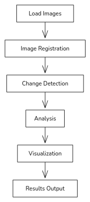

# **Satellite Imagery Analysis Report**

## **1. Overview**

This report details an automated system for analyzing satellite imagery to detect and quantify land use changes, particularly focusing on deforestation and afforestation over time.



## **2. Core Components**

### **2.1 Image Loading and Preprocessing**

-   Utilizes OpenCV for loading satellite images
-   Converts images from BGR to RGB color space
-   Performs input validation and file existence checks

.png>)

### **2.2 Image Registration**

-   Ensures images are correctly aligned
-   Validates matching image dimensions
-   Currently assumes pre-aligned input images

### **2.3 Change Detection Algorithm**

#### **Key Parameters:**

```python
threshold_deforestation = -20
threshold_afforestation = 20
kernel_size = 5
```

#### **Process:**

1. Converts images to HSV color space
2. Analyzes changes in the Value channel
3. Applies thresholding to highlight differences
4. Uses morphological operations for noise reduction

### **2.4 Analysis Methods**

Calculates:

-   Percentage of deforested area
-   Percentage of afforested area
-   Generates binary masks for changed regions

### **2.5 Visualization Components**

Creates a six-panel visualization displaying:

1. Original image (Time 1)
2. Original image (Time 2)
3. Overlay visualization
4. Deforestation mask
5. Afforestation mask
6. Annotated changes

## **3. Implementation Details**

### **3.1 Color Coding**

-   **Red**: Represents deforestation
-   **Green**: Represents afforestation

### **3.2 Mask Generation**

#### **Processing Steps:**

```python
1. Apply binary threshold
2. Perform morphological opening
3. Perform morphological closing
4. Detect contours
```

### **3.3 Output Generation**

-   Saves combined visualization plots
-   Prints change percentages
-   Generates annotated imagery for analysis

## **4. Performance Considerations**

### **4.1 Memory Usage**

-   Efficiently processes large satellite images
-   Manages multiple array copies
-   Requires adequate RAM allocation

### **4.2 Processing Time**

-   Identified bottlenecks:
    -   Image loading
    -   Morphological operations
    -   Contour detection

## **5. Future Improvements**

### **5.1 Potential Enhancements**

1. Implement automated image registration
2. Add support for multi-spectral imagery
3. Integrate machine learning classification
4. Enable batch processing capabilities
5. Develop progress tracking features

### **5.2 Known Limitations**

-   Assumes pre-aligned images
-   Limited to binary classification
-   Uses fixed threshold values

## **6. Conclusion**

The system effectively detects and visualizes land use changes using satellite imagery, providing quantitative insights into deforestation and afforestation patterns. Future improvements aim to enhance automation, classification accuracy, and processing efficiency.
